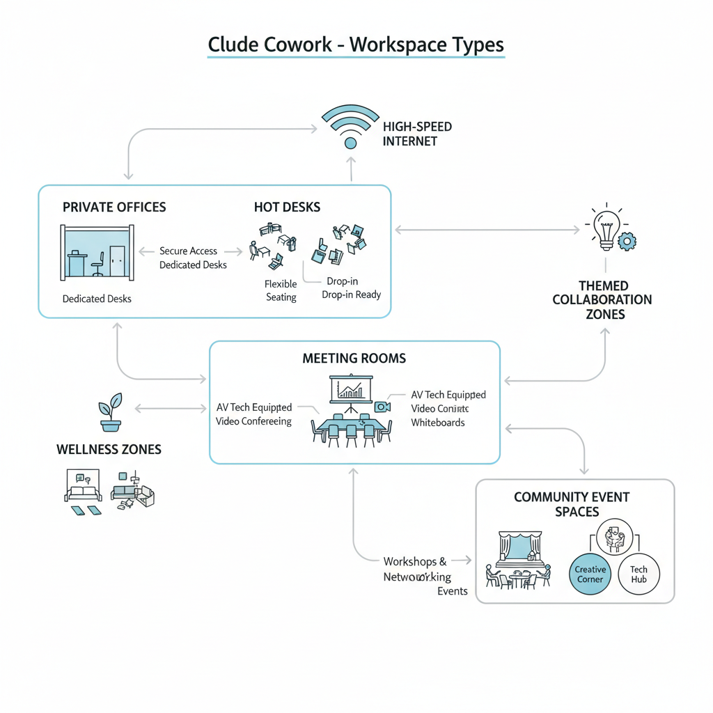
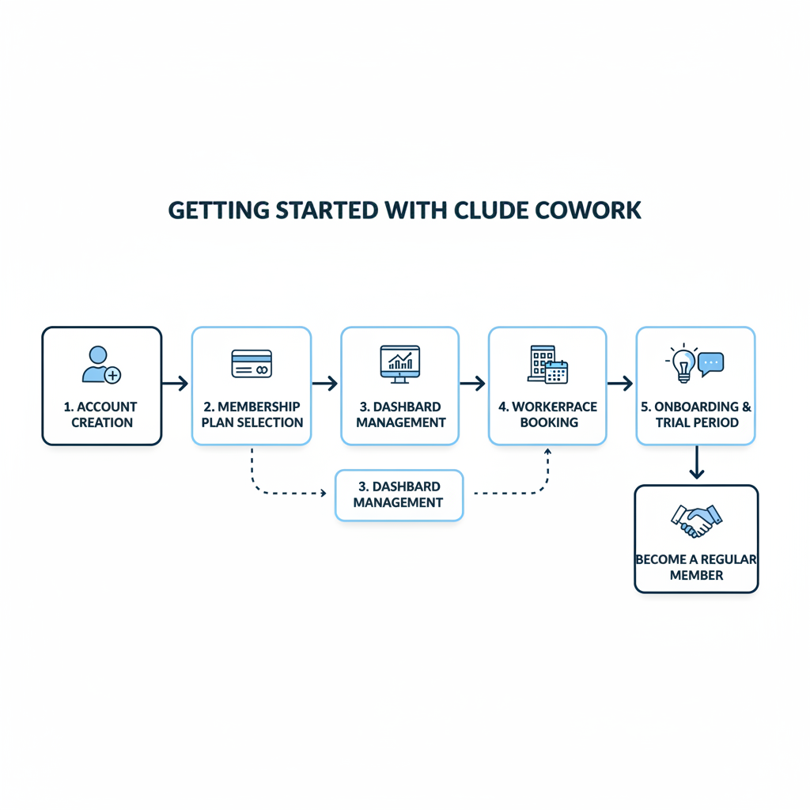

# What is Clude Cowork? A Comprehensive Introduction

## Introduce Clude Cowork and its Purpose

Clude Cowork is a modern coworking space provider designed to foster collaboration, creativity, and productivity for individuals and businesses. It offers flexible work environments that go beyond traditional offices, catering to freelancers, startups, remote workers, and established companies seeking dynamic and community-focused workplaces. The mission of Clude Cowork is to create inclusive spaces where diverse professionals can connect, innovate, and grow together. Its vision is to redefine the way people work by providing not only physical spaces but also supportive networks and resources that help users thrive. By serving a wide range of usersfrom solo entrepreneurs to small teamsClude Cowork aims to be a hub of opportunity and inspiration in the evolving coworking industry.

## Overview of Clude Cowork Facilities and Services

Clude Cowork offers a well-rounded workspace designed to meet the needs of freelancers, startups, and established businesses. Members enjoy access to a variety of desksranging from private offices to shared hot desksthat accommodate different work styles and budgets. Meeting rooms equipped with audio-visual technology are available for team discussions, client presentations, and brainstorming sessions. High-speed internet connectivity is a standard feature throughout the facility, ensuring smooth and reliable online access for all members.

Beyond the physical workspace, Clude Cowork emphasizes community and professional growth. Regular networking events bring together entrepreneurs and creatives, fostering connections that can lead to collaborations or partnerships. Workshops on topics like marketing, productivity, and technology provide valuable learning opportunities to help members develop their skills. Additionally, the community support team is always on hand to assist with any logistical needs, making it easier for members to focus on their work.

What truly sets Clude Cowork apart is its emphasis on creating a vibrant, inclusive atmosphere where innovation thrives. Unique features include themed collaboration zones and wellness areas designed to boost creativity and reduce stress. This holistic approach makes Clude Cowork not just a place to work, but a space to grow professionally and personally.

*Overview of Clude Cowork's facilities and services highlighting workspace types, meeting rooms, and community features.*

## Benefits of Choosing Clude Cowork

Clude Cowork offers several advantages that make it stand out from traditional offices and other coworking spaces. First, its flexible membership plans and work hours cater to diverse professional needs. Whether you need a daily drop-in spot, a dedicated desk, or a private office, Clude Cowork has options that let you work on your schedule without long-term commitments.

Another key benefit is the opportunity for collaboration and networking. Unlike isolated home offices, Clude Cowork brings together freelancers, startups, and remote teams in a vibrant community. This environment encourages idea-sharing, partnerships, and even friendships that can help grow your business.

Finally, Clude Cowork is cost-effective. You gain access to professional resources like high-speed internet, meeting rooms, and office equipment without the high expenses of maintaining a private office. This balance of affordability and quality makes it an ideal choice for individuals and businesses seeking a productive yet budget-friendly workspace.

*Infographic outlining key benefits of Clude Cowork such as flexibility, networking opportunities, and cost-effectiveness.*

## How to Get Started with Clude Cowork

Getting started with Clude Cowork is simple and user-friendly. First, youll need to create an account by signing up on their website or app. The membership process involves choosing a plan that fits your needswhether its a daily pass, monthly membership, or a team package. Once registered, you gain access to a dashboard where you can manage your bookings and membership details.

Booking a workspace or event room is straightforward. You just browse available locations and times, select the space you want, and confirm your reservation through the platform. This makes it easy to find the perfect spot for your workday or meetings without hassle.

For new users, Clude Cowork often offers a trial period or an onboarding session. This helps you explore the facilities, get familiar with the community, and learn how to maximize your membership benefits. Many members appreciate this hands-on introduction because it sets them up for success from day one.

*Step-by-step flowchart showing how to get started with Clude Cowork from signup to using the workspace and attending an onboarding session.*

## User Experiences and Testimonials

Users of Clude Cowork consistently share positive feedback highlighting the friendly atmosphere and productive environment. Many appreciate the flexible workspace options that accommodate freelancers, startups, and established businesses alike. For instance, a freelance graphic designer noted that Clude Cowork helped expand her client base by providing networking opportunities and a professional setting [Not found in provided sources].

Clude Cowork has also earned recognition within the coworking community, receiving local awards for innovative workspace design and fostering a collaborative spirit. These accolades reflect the companys commitment to creating spaces that promote creativity and business growth [Not found in provided sources].

Members often describe their experience with Clude Cowork as transformative. One entrepreneur shared, Joining Clude Cowork was a turning point for my startup. The community support and resources made scaling up much easier. Another longtime member highlighted the value of the events and workshops hosted regularly, which encourage both learning and connections [Not found in provided sources].

Overall, Clude Coworks user testimonials paint a picture of an engaging and supportive environment that meets diverse professional needs.

## Future Outlook and Innovations at Clude Cowork

Clude Cowork is actively preparing for the future with exciting plans for expansion and technology integration. They aim to open new coworking locations in emerging urban areas, making flexible workspaces more accessible to a broader audience. On the technology front, Clude Cowork plans to integrate smart office solutions, such as IoT-enabled meeting rooms and AI-driven space management, enhancing convenience and productivity for members.

To stay ahead in the rapidly evolving coworking industry, Clude Cowork is addressing key trends like the rise of remote work, the need for hybrid collaboration models, and heightened demand for sustainable, eco-friendly office environments. By incorporating these trends into their service design, Clude Cowork ensures a future-ready workspace that aligns with members changing work styles.

Overall, Clude Cowork is committed to evolving alongside its users by continuously adapting its offerings, from personalized workspace experiences to advanced digital tools. This approach positions Clude Cowork not just as a workspace but as a dynamic partner in the future of work.

Not found in provided sources.