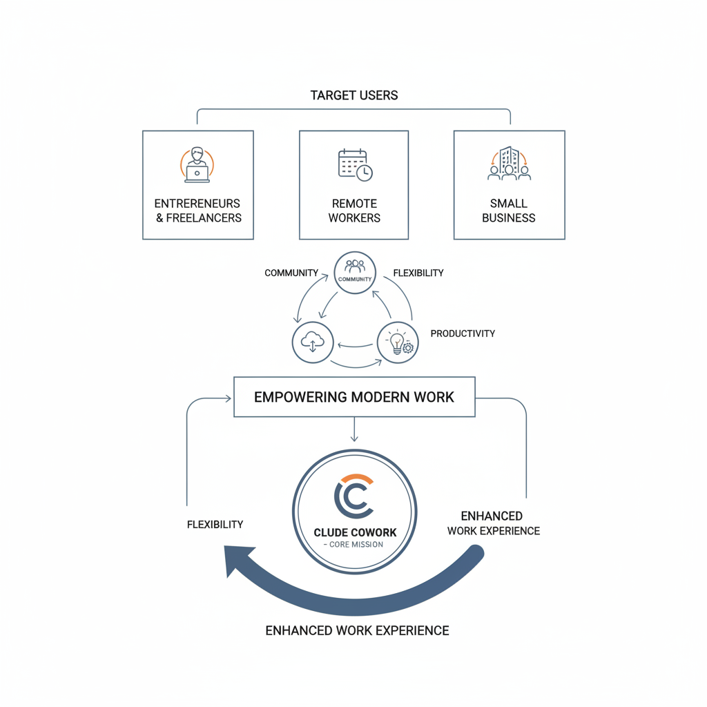
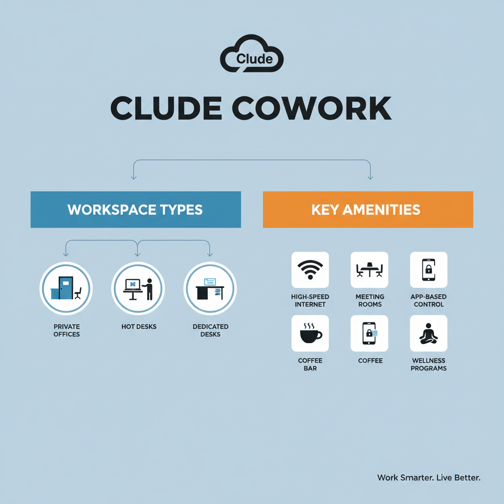
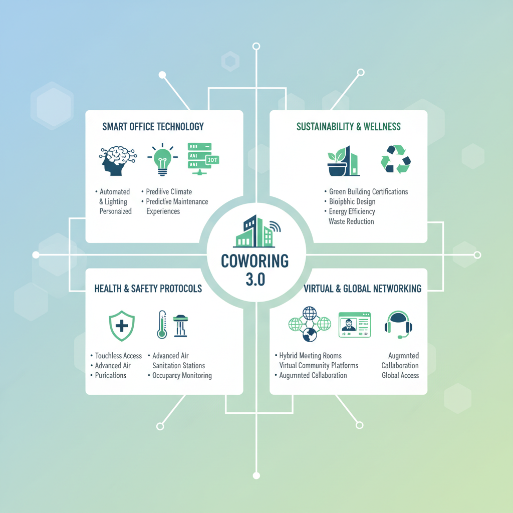

# What is Clude Cowork? An In-Depth Overview of the Modern Coworking Solution

## Introduce Clude Cowork and Its Core Concept

Clude Cowork is a modern coworking space provider designed to offer flexible, innovative work environments for a diverse range of professionals. It caters primarily to entrepreneurs, freelancers, remote workers, and small business owners who seek more than just a desk	6they look for a community that fosters collaboration and productivity. By focusing on creating adaptable spaces, Clude Cowork enables individuals and teams from various sectors, including technology, creative industries, consulting, and startups, to work in an environment that supports their unique needs.

At its core, Clude Cowork019s mission is to revolutionize the traditional office experience by offering accessible, well-equipped, and inspiring workplaces that promote professional growth and connection. Its vision extends beyond providing workspace	7it aims to build vibrant communities where innovation thrives, networking is seamless, and work-life balance is prioritized. Clude Cowork recognizes the shifting trends in how people work today, emphasizing flexibility, inclusivity, and the importance of an engaging atmosphere.

What sets Clude Cowork apart in an increasingly crowded coworking market is its commitment to personalized service and a holistic approach to coworking. Unlike generic shared office spaces, Clude Cowork integrates cutting-edge amenities with tailored community events and business support resources. This approach not only supports productivity but also encourages meaningful relationships among members. Additionally, its locations are thoughtfully designed to blend comfort and functionality, appealing to professionals who value both atmosphere and efficiency.

For potential users, Clude Cowork offers actionable benefits such as scalable membership options, access to professional networks, and environments optimized for focus and creativity. Overall, it represents a forward-thinking solution that responds to the evolving needs of today019s workforce, making it an attractive choice for anyone looking to maximize their work experience in a flexible yet community-driven setting.

*Diagram illustrating Clude Cowork's core concept, mission, and target user segments.*

## Explore the Key Features and Amenities Offered by Clude Cowork

Clude Cowork stands out in the modern coworking landscape by offering a versatile range of workspace solutions tailored to meet the diverse needs of entrepreneurs, freelancers, remote workers, and small business owners. Members can choose from private offices, hot desks, and dedicated desks, ensuring flexibility and convenience. Private offices provide a secure, quiet environment for teams or individuals requiring focus and privacy, while hot desks offer an open seating arrangement ideal for those who prefer a dynamic, communal workspace. Dedicated desks combine the benefits of a personal workspace with the community feel, granting users a consistent spot without a full office commitment.

Beyond the workstations themselves, Clude Cowork is equipped with essential amenities that support productivity and collaboration. Members enjoy high-speed internet to keep their operations smooth and uninterrupted, professional meeting rooms designed for presentations or brainstorming sessions, and regularly hosted community events that foster networking and knowledge exchange. These features help craft a vibrant ecosystem where professionals can grow their businesses while connecting with like-minded peers.

Technology integration is another cornerstone of Clude Cowork019s appeal. Smart office features such as app-based access control and automated booking systems streamline daily operations, allowing members to manage their workspace use effortlessly. These technologies not only enhance security but also optimize space utilization and convenience, reflecting the evolving expectations of modern workers who value seamless, tech-driven experiences.

Moreover, Clude Cowork goes beyond the basics by offering additional perks that enrich the daily experience. Members can enjoy well-stocked coffee bars that encourage informal interactions and energize the workday. Networking events are frequently organized, creating opportunities to build meaningful professional relationships. Wellness programs, including yoga classes or meditation sessions, support overall health and work-life balance, recognizing that well-being is fundamental to sustained productivity.

In summary, Clude Cowork combines a comprehensive suite of workspace options, essential and smart amenities, and thoughtful extras that cater to the needs of today019s workforce. Whether you019re seeking a private office, a flexible hot desk, or a dedicated desk, Clude019s smart, community-focused environment empowers members to thrive professionally while enjoying valuable lifestyle benefits.

*Chart depicting types of workspace (private offices, hot desks, dedicated desks) alongside key amenities like high-speed internet, meeting rooms, smart office features, coffee bar, and wellness programs.*

## Discuss Membership Plans and Pricing Models

Clude Cowork offers a variety of membership plans designed to meet the diverse needs of entrepreneurs, freelancers, remote workers, and small business owners. Understanding these options can help you select the best fit for your work style and budget.

### Types of Memberships

1. **Daily Passes**  
   Ideal for those who need occasional workspace without a long-term commitment. Daily passes provide access to all basic coworking amenities such as high-speed internet, communal work areas, and common meeting rooms for a single day.

2. **Monthly Plans**  
   Designed for members requiring more consistency, these plans often come in several tiers:
   - **Hot Desk:** Access to any available seat in the common area, perfect for freelancers or solo entrepreneurs who don019t need a dedicated spot.
   - **Dedicated Desk:** Reserved workspace for those who prefer consistency and privacy.
   - **Private Offices:** Fully enclosed offices for teams or individuals who value focus and confidentiality.

3. **Long-Term Leases**  
   For startups or small businesses with stable space needs, Clude Cowork offers long-term rental options. These leases often include customized office layouts and additional services such as mail handling and exclusive meeting room access.

### Pricing Tiers and Inclusions

- **Daily Passes** are usually priced affordably, providing cost-effective access for infrequent users. Prices can range depending on location and demand but generally include amenities like unlimited coffee, printing, and event access.
- **Monthly Plans** vary by tier	7hot desks are the most economical, with dedicated desks and private offices priced higher due to additional privacy and security.
- **Long-Term Leases** tend to offer the best value per square foot but require upfront commitment and may include concierge services.

### Flexible and Hybrid Options

Recognizing the rise in hybrid work models, Clude Cowork offers "Hybrid Plans" that combine remote and on-site work. For example, some plans provide a set number of coworking days per month plus 24/7 access to virtual networking and resources. This flexibility supports remote-first professionals who occasionally need physical office space.

### Choosing the Best Plan

When evaluating plans, consider:

- **Frequency of Use:** If you work on-site sporadically, daily passes may save money; if you019re in the space most weekdays, monthly plans are more cost-effective.
- **Privacy Needs:** Dedicated desks or private offices suit those needing quiet or confidential environments.
- **Team Size:** Larger teams benefit from private offices or long-term leases tailored to group work.
- **Budget and Commitment:** Longer leases typically offer savings but require upfront agreements. Hybrid options can balance flexibility with predictable costs.

Ultimately, Clude Cowork019s diverse membership framework empowers users to tailor their workspace to their evolving professional needs and lifestyles, keeping pace with modern coworking trends that emphasize flexibility, community, and productivity.

## Highlight the Community and Networking Opportunities at Clude Cowork

One of the standout features of Clude Cowork is its vibrant community and the wealth of networking opportunities it offers. Whether you019re an entrepreneur, freelancer, or small business owner, Clude Cowork is designed to connect you with like-minded professionals through a variety of community events and workshops, held both onsite and virtually. These gatherings range from skill-building workshops and industry-specific panels to casual meetups and social events, all aimed at fostering meaningful connections and collaborative learning.

Clude Cowork doesn019t just provide a physical space; it actively facilitates collaboration among its members. Shared project boards, interest-based groups, and dedicated collaboration zones encourage members to work together, exchange ideas, and develop partnerships. This environment nurtures creativity and innovation by breaking down barriers that often exist in isolated work settings.

Testimonials from community members highlight the real-world benefits of Clude Cowork019s networking ecosystem. For example, many have successfully launched joint ventures, found freelance clients through referral networks, or gained valuable mentorship from more experienced professionals within the space. These success stories underscore how deeply embedded community support is in Clude Cowork019s culture.

Central to this supportive atmosphere are the community managers and support staff. These team members are more than just facility overseers; they actively engage with members, organize events, and ensure everyone feels welcomed and connected. Their commitment to member success helps cultivate a dynamic, inclusive workplace where professional and personal growth are prioritized.

In a market where coworking spaces are increasingly defined by the quality of community and networking they offer, Clude Cowork remains a modern leader by continuously enhancing opportunities for engagement and collaboration. For anyone looking to expand their professional network or find a supportive work environment, Clude Cowork019s community-focused approach delivers significant value.

## Analyze How Clude Cowork Supports Remote and Hybrid Work Models

Clude Cowork is designed with the modern workforce in mind, offering flexible workspace solutions that cater specifically to remote and hybrid work trends. In today019s evolving work environment, employees and teams require adaptable office options that promote productivity without sacrificing safety. Clude Cowork answers this call by providing diverse workspace layouts	7from private offices and dedicated desks to open areas and hot desks	7allowing users to choose settings that fit their workstyle and schedules. Their commitment to rigorous health and safety protocols, such as enhanced cleaning routines and touchless entry systems, ensures a safe environment that meets the anxieties and requirements of hybrid workers returning to physical spaces.

Technology plays a central role at Clude Cowork, where integration with advanced collaboration tools supports seamless remote teamwork. High-speed internet, video conferencing setups, and smart meeting rooms are standard, empowering users to connect effortlessly with colleagues worldwide. Clude also incorporates cloud-based platforms and project management software access into their infrastructure, facilitating synchronous and asynchronous communication crucial for distributed teams. This tech-savvy environment minimizes common remote work barriers like connectivity issues and coordination difficulties, making transitions between home and coworking spaces fluid and productive.

Addressing the needs of distributed teams, Clude Cowork offers customizable membership plans and booking systems that accommodate varying work patterns. Teams can reserve spaces on-demand or secure long-term arrangements that align with their operational rhythms. Furthermore, Clude fosters community engagement through networking events and collaborative projects, helping remote and hybrid workers combat isolation and build professional connections. This approach makes it easier for geographically dispersed teams to unify around shared goals despite physical distance.

Lastly, Clude emphasizes work-life balance through policies and wellness programs tailored to the hybrid model. Flexible hours, quiet zones, and wellness rooms support mental health and reduce burnout. Programs like mindfulness sessions, fitness classes, and social gatherings help users maintain a healthy separation between work and personal life, which is key to sustainable remote work. By aligning their services with both the functional and emotional dimensions of hybrid work, Clude Cowork offers a comprehensive, supportive environment that keeps pace with contemporary work trends, ensuring users can thrive regardless of where or how they work.

In summary, Clude Cowork019s multi-faceted support for remote and hybrid work encompasses flexible safe spaces, integrated technology, distributed team accommodations, and wellness-focused policies	7making it a forward-thinking solution for today019s dynamic labor landscape.

## Provide Guidance on How to Join and Make the Most of Clude Cowork

Joining Clude Cowork is designed to be a seamless experience, allowing entrepreneurs, freelancers, and small business owners to quickly integrate into a dynamic workspace. Here019s how to get started and thrive within the community.

**Step-by-Step Instructions for Signing Up and Onboarding**  
1. **Visit the Clude Cowork website or app:** Begin by exploring available membership plans tailored to different needs, from hot desks to private offices.  
2. **Choose your membership:** Select the option that fits your work style and budget. Many plans offer flexible durations and access times.  
3. **Complete your registration:** Provide basic information, payment details, and agree to the community guidelines.  
4. **Schedule your onboarding tour:** New members can book an orientation session to familiarize themselves with the space, policies, and available resources.  
5. **Set up your profile:** Within the community app or platform, add your professional details to enhance networking possibilities.

**Tips for Setting Up a Productive Workspace Within Clude Cowork**  
- Choose a spot that suits your work routine	7whether you prefer quiet zones or more social areas.  
- Personalize your desk with minimal essentials to keep focused and comfortable.  
- Use noise-canceling headphones or white noise apps if you need to block distractions.  
- Take advantage of ergonomic furniture provided to maintain good posture during long work sessions.

**Advice on Engaging with the Community and Maximizing Network Benefits**  
- Join Clude Cowork019s online community forums and discussion groups to connect with other members.  
- Attend member meetups and social hours to build relationships beyond just professional exchanges.  
- Volunteer or suggest ideas for community events	7active participation fosters stronger bonds and opens doors to collaborations.  
- Use available mentorship or skill-share programs to both learn and contribute valuable expertise.

**Recommendations for Utilizing Amenities and Events Effectively**  
- Make full use of amenities like high-speed internet, printing services, meeting rooms, and phone booths to enhance your work efficiency.  
- Regularly check the events calendar and sign up for workshops, guest speaker sessions, and networking mixers that align with your interests.  
- Take breaks in communal areas to refresh and spark spontaneous conversations that could lead to new opportunities.  
- Leverage Clude Cowork019s partnerships and discounts with nearby businesses to extend your professional benefits.

By following these steps and tips, new members can not only settle into Clude Cowork quickly but also tap into its full potential as a hub for productivity, collaboration, and growth.

## Discuss Future Trends and Innovations in Coworking Spaces Related to Clude Cowork

As the coworking industry continues to evolve, several emerging trends and innovations are shaping the future of shared workspaces, and Clude Cowork is positioning itself at the forefront of these changes.

### Emerging Technologies Influencing Coworking Spaces

Technology is revolutionizing how coworking spaces operate and deliver value. Smart office solutions, such as IoT sensors and AI-driven space management, optimize the use of desks and meeting rooms, enhancing efficiency for users. Virtual and augmented reality tools are beginning to offer immersive collaboration experiences for remote and on-site members alike. Clude Cowork leverages these technologies to provide seamless booking systems, personalized workspace adjustments, and enhanced connectivity, ensuring users enjoy a tech-savvy environment that supports productivity and flexibility.

### Sustainability and Wellness Trends

Modern coworking spaces increasingly emphasize sustainability and wellness. From energy-efficient lighting and eco-friendly materials to biophilic design elements that improve air quality and mental well-being, these spaces foster healthier work environments. Clude Cowork integrates green building practices and wellness-focused amenities, such as natural lighting, ergonomic furniture, and quiet zones, aligning with the preferences of environmentally conscious and health-aware entrepreneurs and freelancers.

### Evolution of Coworking Post-Pandemic

The COVID-19 pandemic has permanently altered workspace needs, accelerating hybrid work models. Future coworking solutions are expected to offer even greater flexibility, combining on-demand access with robust health and safety protocols. Contactless check-ins, enhanced cleaning routines, and spaced seating are becoming standard. Clude Cowork is adapting by expanding its flexible membership plans and incorporating advanced hygiene technologies to meet evolving user expectations while maintaining a vibrant community.

### Clude Cowork019s Innovation Roadmap

To stay competitive, Clude Cowork focuses on continuous innovation by integrating cutting-edge technology with user-centric design. Plans include expanding digital platforms to support virtual networking and skill-sharing among members, deploying AI for personalized space recommendations, and investing in sustainable infrastructure that meets high environmental standards. These initiatives ensure Clude Cowork remains a leader in delivering a modern, adaptive, and inspiring coworking experience for entrepreneurs, freelancers, and small businesses.

*Illustration showing emerging technologies, sustainability, wellness, and post-pandemic adaptations shaping Clude Cowork’s future.*

By embracing these future trends, Clude Cowork demonstrates a commitment to evolving with the needs of the modern workforce, making it an attractive option for those seeking not just a workspace but a forward-thinking community.