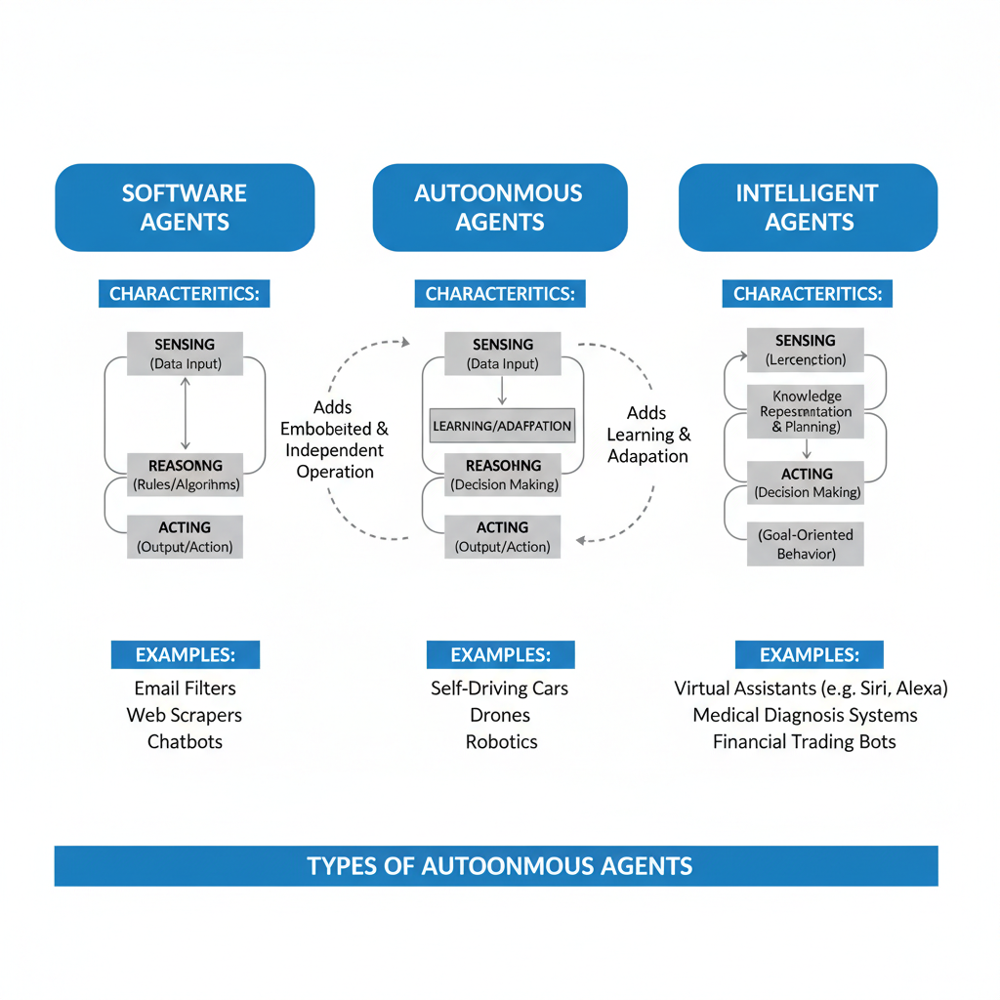
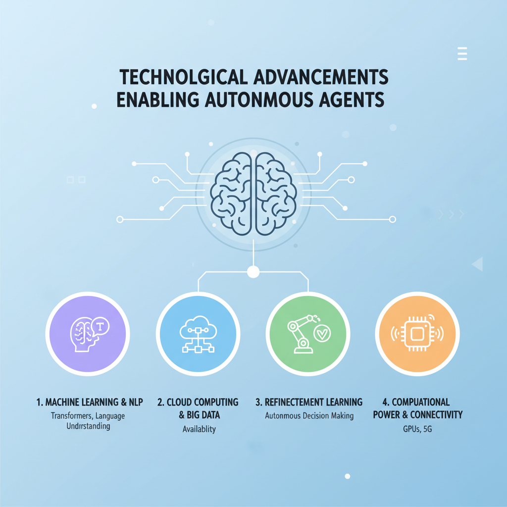
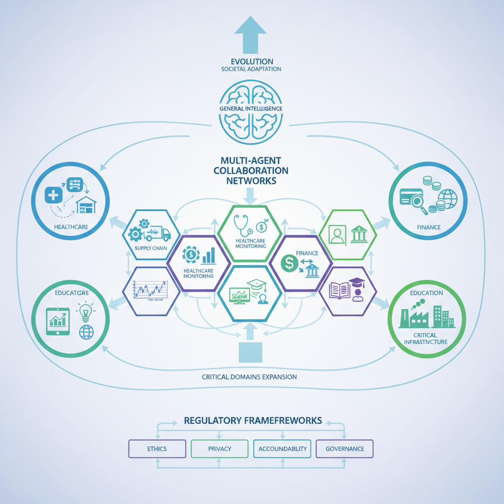

# Why Are Agents Getting Popular? Exploring the Rise of Autonomous Systems

## Define what is meant by 'agents' in the context of modern technology

In the realm of AI and automation, an **agent** refers to an autonomous entity designed to perceive its environment, reason about it, and take actions to achieve specific goals. Unlike traditional software programs or scripts that follow a fixed sequence of instructions without adaptation, agents possess the ability to make decisions based on dynamic inputs and changing contexts. This fundamental characteristic empowers agents to operate with a degree of independence and flexibility that standard programs lack.

To better understand the distinction, consider a simple script that automates file backups—it performs a set of predefined steps each time it runs, without adapting to new situations or unexpected errors. In contrast, an agent involved in the same task might monitor system status, detect potential issues, and modify its behavior to optimize backup performance or avoid conflicts, all without human intervention.

Agents can be broadly categorized into several types:

- **Software agents**: Programs that carry out tasks on behalf of users, such as email filters or recommendation systems.
- **Autonomous agents**: Systems capable of operating without external control, adapting their actions based on environment feedback, like self-driving car software.
- **Intelligent agents**: Agents embedded with AI techniques, enabling them to learn, plan, and solve complex problems, such as virtual assistants or game bots.

In essence, agents are central to modern automation because they integrate sensing, reasoning, and acting capabilities. This integration allows them to automate decision-making processes and handle complex tasks that traditionally required human oversight, marking a significant evolution in how technology interacts with the world.

*Types of Autonomous Agents and their Core Capabilities*

## Outline the Technological Advancements Enabling the Popularity of Agents

The surge in popularity of autonomous agents is closely tied to several key technological advancements that have significantly enhanced their capabilities and accessibility. Understanding these factors helps clarify why agents are becoming core components in AI-driven applications.

### Improvements in Machine Learning and Natural Language Processing

One of the primary enablers is the dramatic progress in machine learning (ML), particularly in natural language processing (NLP). Modern NLP models have become profoundly better at understanding and generating human language, thanks to architectures like transformers and attention mechanisms. This allows agents to interpret complex instructions, engage in meaningful conversations, and perform tasks that require contextual understanding. For example, chatbots can now manage customer support with human-like responsiveness, bridging the gap between users and automated systems with unprecedented fluidity.

### Advances in Cloud Computing and Data Availability

The growth of cloud infrastructure plays a critical role in agent adoption. Cloud platforms provide scalable, on-demand computing resources that support intensive AI workloads without local hardware constraints. This means developers and businesses can deploy agents that continuously learn and improve by leveraging vast datasets hosted on distributed cloud servers. Additionally, the explosion of data—from social media, IoT devices, and enterprise systems—feeds machine learning models with diverse, high-quality inputs, enabling agents to become more accurate and versatile.

### Development in Reinforcement Learning and Autonomous Decision Systems

Reinforcement learning (RL) has emerged as a powerful approach in training agents to make autonomous decisions through trial and error in dynamic environments. Unlike traditional supervised learning, RL enables agents to optimize strategies based on feedback from their actions, which is crucial in complex, real-world tasks such as robotics, game playing, and resource management. This autonomy in decision-making allows agents to adapt to changing conditions without explicit programming for every scenario, greatly increasing their practical utility.

### Increases in Computational Power and Connectivity

Finally, the steady increase in computational power, driven by advancements in GPUs, TPUs, and specialized AI chips, provides agents with the processing capacity needed for real-time inference and learning. Moreover, improvements in network connectivity—including widespread 5G and edge computing—allow agents to operate with minimal latency and coordinate actions across distributed systems. This interconnected environment supports agents functioning effectively both individually and collaboratively in diverse applications ranging from personal assistants to industrial automation.

Together, these technological developments form the foundation for the rapid rise of autonomous agents, making them more capable, scalable, and integral to modern AI solutions.

*Key Technological Advancements Driving Agent Popularity*

## Explain Practical Applications and Use Cases Driving Agent Popularity

One of the key reasons autonomous agents are gaining popularity is their wide range of practical applications that bring tangible benefits across various industries. By examining some prominent use cases, we can better understand why more organizations are adopting agents as integral components of their technology strategies.

### Customer Support Chatbots and Virtual Assistants

Perhaps the most familiar example for many users is the rise of customer support chatbots and virtual assistants. These AI-powered agents interact with customers through natural language, providing instant responses to common questions, troubleshooting issues, and guiding users through processes such as booking or account management. By automating routine interactions, companies reduce wait times, improve customer satisfaction, and free human agents to focus on more complex tasks. For example, banks deploy chatbots to handle balance inquiries or transaction disputes, while e-commerce platforms use virtual assistants to help with product searches and order tracking.

### Automation in Business Processes

Beyond direct customer interaction, agents play a crucial role in automating internal business workflows. Intelligent agents can monitor data streams, trigger alerts, and execute repetitive tasks without human intervention. This covers a broad range of scenarios including invoice processing, supply chain management, and fraud detection. For instance, in finance, agents can autonomously validate transactions by cross-checking records and flagging anomalies, speeding up compliance checks and minimizing errors. By integrating agents into enterprise resource planning (ERP) systems, businesses achieve greater efficiency and agility, allowing employees to focus on strategic activities.

### Agents in Robotics and IoT Devices

The physical world also benefits extensively from autonomous agents, especially in robotics and Internet of Things (IoT) ecosystems. Robots powered by agents can navigate environments, perform maintenance, or assist in logistics without constant human control. In manufacturing, agents direct robots for assembly line tasks, adapting to real-time conditions to optimize throughput. Similarly, smart home devices such as thermostats and security systems use agents to learn user preferences and adjust settings dynamically, enhancing comfort and energy savings. These systems exemplify how agents enable seamless interaction between software intelligence and hardware capabilities.

### Personalized Recommendation and Adaptive Systems

Finally, agents are instrumental in building personalized and adaptive user experiences. Streaming platforms, online retailers, and news aggregators rely on recommendation agents that analyze user behavior, contextual data, and preferences to suggest relevant content. These agents continuously learn and adapt, making their suggestions more accurate over time. In education technology, adaptive learning platforms use agents to tailor lessons to individual students' progress and challenges, promoting more effective learning outcomes. This personalized approach drives user engagement, loyalty, and satisfaction.

---

These examples highlight how agents transform diverse fields by automating interactions, optimizing operations, and delivering customized experiences. Their versatility and ability to manage complexity autonomously is a key factor behind their growing adoption in both consumer and enterprise contexts.

## Explore the Role of Agents in Enhancing User Experience and Productivity

One of the most significant reasons agents are gaining popularity is their ability to reduce manual efforts through automation. Instead of users performing repetitive or time-consuming tasks themselves, agents can handle these activities seamlessly in the background. For example, an agent can automatically organize incoming emails or generate reminders without constant user input, freeing up valuable time and mental energy.

Beyond simple automation, agents bring personalization and contextual awareness to interactions. By learning user preferences and understanding the context in which tasks occur, agents provide smarter assistance tailored to individual needs. This means recommendations, notifications, or actions are more relevant, reducing friction and making software feel more intuitive. For instance, an agent might prioritize certain emails based on your usual habits or adjust your calendar suggestions according to your current workload.

Collaboration between humans and agents further amplifies productivity. Rather than replacing users, agents act as intelligent assistants that complement human decision-making by handling routine tasks or suggesting optimizations. This partnership enables people to focus on higher-level responsibilities, creativity, or problem-solving instead of getting bogged down in details. A practical example is auto-scheduling tools where agents coordinate meeting times across multiple participants, reducing back-and-forth communication and speedily locking down appointments.

Intelligent email management illustrates this synergy well: agents can classify messages by importance, suggest quick replies, and even flag follow-ups, helping users maintain control over their inboxes without feeling overwhelmed. These small but powerful enhancements cumulatively improve user experience by making digital interactions smoother and increase productivity by reducing friction and cognitive load.

In essence, agents serve as proactive collaborators that adapt to users' routines and contexts, automating what’s redundant while enriching what requires human insight. This blend of automation, personalization, and partnership is key to why autonomous agents are reshaping how we work and interact with technology.

## Analyze Challenges and Ethical Considerations Surrounding Agent Deployment

As autonomous agents become more prevalent in software applications and real-world systems, several critical challenges and ethical considerations arise that developers and organizations must address.

### Privacy and Data Security Concerns

Autonomous agents typically process large volumes of user data to make decisions, personalize experiences, or automate tasks. This reliance on data raises significant privacy concerns, especially when sensitive information is involved. For example, a virtual assistant agent accessing personal calendars, emails, and location data must ensure this information is securely managed to prevent unauthorized access or leaks. Data breaches or misuse could compromise user trust and violate regulations such as GDPR or CCPA. Implementing robust encryption, access controls, and anonymization techniques is crucial to safeguarding privacy in agent deployment.

### Transparency and Explainability Challenges

Agents often operate as complex AI systems, sometimes using deep learning or reinforcement learning algorithms that behave like 22black boxes.22 This opacity makes it difficult for users and stakeholders to understand how an agent arrives at a particular decision. For instance, a financial advisory agent recommending investments must provide explanations that users can comprehend to build trust and meet regulatory requirements. Lack of transparency can also hinder debugging and improving agents. Thus, developing explainable AI methods that clarify agent reasoning without sacrificing performance is an ongoing research and practical challenge.

### Bias and Fairness Issues

Another ethical concern is that agents can inherit or even amplify biases present in their training data or design. For example, a recruitment agent screening job applicants might inadvertently favor certain demographics if trained on historical hiring data reflecting past prejudices. Such bias can lead to unfair treatment and discrimination, undermining ethical standards and legal compliance. It is essential to rigorously audit data sources, incorporate fairness constraints, and continuously monitor agents for unintended discriminatory effects.

### Dependence on Agents and Employment Impact

As agents automate more cognitive and routine tasks, there is growing anxiety about over-dependence and potential job displacement. Agents can enhance productivity by handling repetitive or complex chores, enabling humans to focus on higher-level work. However, this shift can disrupt labor markets, requiring workforce reskilling and careful policy considerations. Furthermore, excessive trust in autonomous systems may reduce human oversight, increasing risks if agents malfunction or face adversarial scenarios.

In summary, while autonomous agents offer exciting capabilities, responsible deployment demands addressing these challenges through technical safeguards, ethical design, and societal dialogue to ensure their benefits are realized without detrimental consequences.

## Predict future trends and the evolving role of agents

The future of autonomous agents points toward a growing integration of multi-agent systems, where networks of specialized agents collaborate to solve complex problems more efficiently than individual agents alone. For example, in supply chain management, different agents could independently monitor inventory, predict demand, and optimize logistics, working in concert to streamline operations. This collective intelligence enhances scalability and adaptability, making systems more resilient and capable of handling diverse tasks.

We can also expect significant expansion of agents across critical domains such as healthcare, finance, and education. In healthcare, autonomous agents might assist with patient monitoring, personalized treatment recommendations, or managing administrative workflows, reducing human error and improving patient outcomes. In finance, agents could automate risk assessments, fraud detection, or portfolio management, providing faster and more consistent insights. Education stands to benefit through personalized learning agents that adapt to individual student needs and learning styles, promoting engagement and improving knowledge retention.

Advancements in agent autonomy and general intelligence will be pivotal to these developments. As agents become better at understanding context, reasoning, and adapting without constant human supervision, their capabilities will grow correspondingly. This evolution may include improved natural language comprehension, enhanced decision-making frameworks, and the ability to handle ambiguous or novel situations85 pushing agents closer to flexible, general-purpose AI assistants.

At the same time, regulatory frameworks and societal norms will need to adapt to the proliferation of autonomous agents. Issues of accountability, privacy, and ethical use will gain prominence, necessitating clear guidelines and oversight mechanisms. Society must balance innovation with safety and fairness, ensuring agents are deployed responsibly while fostering trust among users.

In summary, the trajectory of autonomous agents suggests deeper multi-agent collaboration, broader application across industries, enhanced intelligence, and evolving social and regulatory landscapes. These trends collectively signal a future where agents become indispensable partners in both everyday tasks and complex decision-making processes.

*Future Trends and Evolving Roles of Autonomous Agents*