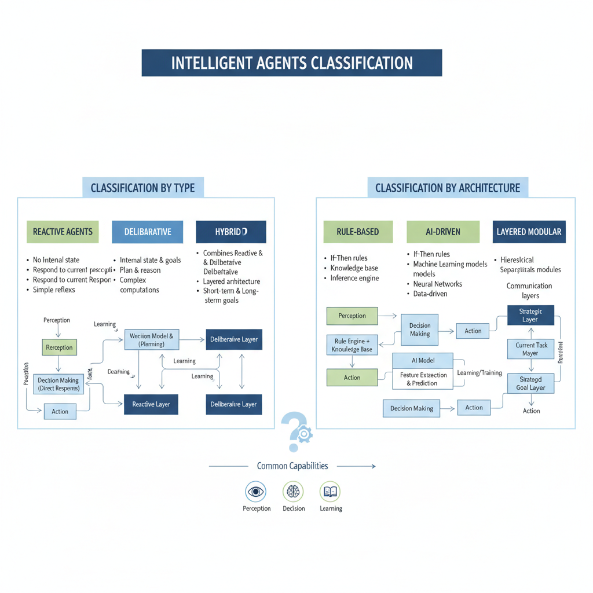
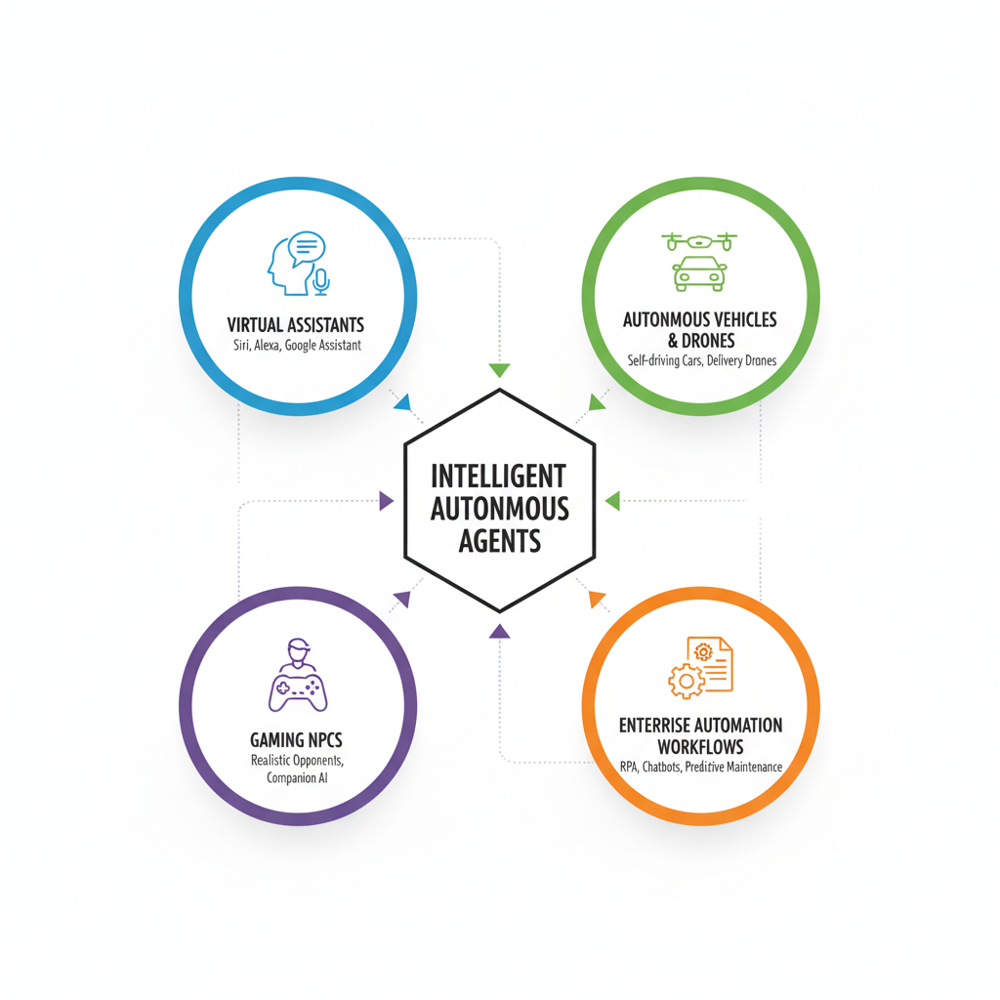
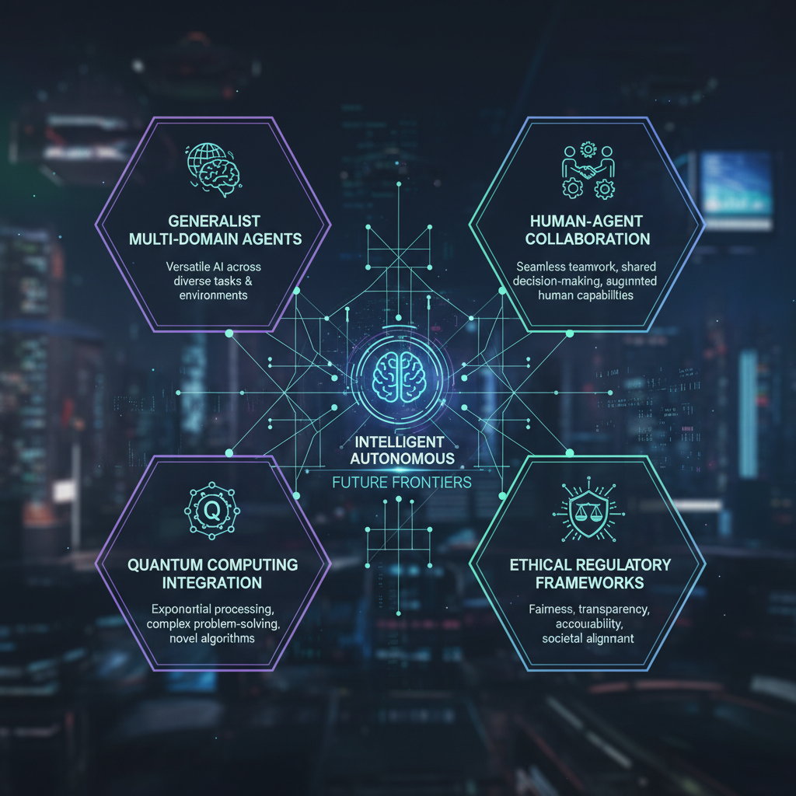

# Why Are Agents Getting Popular? Exploring the Rise of Intelligent Autonomous Systems

## Define What Intelligent Agents Are and How They Work

Intelligent agents are software entities designed to perceive their environment, make decisions, and take actions autonomously to achieve specific goals. These agents operate within autonomous systems, which can range from simple automation scripts to complex AI-powered platforms. The core idea is that these agents act independently, adapting to changing conditions without needing constant human intervention, making them powerful tools in today’s technology landscape.

At their essence, intelligent agents possess three key capabilities: perception, decision-making, and learning. Perception allows agents to gather data from their surroundings through sensors or input channels	6this could be anything from reading user commands to analyzing real-time market data. Decision-making involves processing this information based on pre-defined rules or learned patterns to choose an appropriate course of action. Learning, often powered by machine learning techniques, enables agents to improve their performance over time by learning from past experiences or new data.

Agents can be categorized into several types based on how they process information and make decisions:

- **Reactive Agents** operate on a straightforward stimulus-response mechanism. They react immediately to environmental changes without maintaining internal models or planning ahead. For example, a thermostat that turns heating on or off based on temperature readings is a reactive agent.
  
- **Deliberative Agents** maintain an internal representation of the world and use reasoning or planning to decide on their actions. These agents think ahead and consider multiple steps, much like a chess program that evaluates possible moves before choosing one.
  
- **Hybrid Agents** combine both reactive and deliberative approaches, enabling them to respond quickly while also planning strategically. This makes them suitable for complex scenarios where adaptability and foresight are essential.

The architecture of intelligent agents also varies widely, shaping their capabilities and applications:

- **Rule-Based Agents** follow a set of predefined if-then rules, making decisions based on explicit instructions. They are easy to understand and implement but can struggle with unforeseen situations.
  
- **AI-driven Agents** leverage artificial intelligence techniques like neural networks, reinforcement learning, or natural language processing to interpret data and make decisions. These agents can handle ambiguity and learn from experience, enabling more sophisticated behavior.
  
- **Layered and Modular Architectures** integrate different subsystems	6such as perception, reasoning, and action modules	6allowing for better scalability and flexibility, especially in autonomous vehicles and robotics.

Understanding these fundamental concepts helps demystify why intelligent agents are gaining traction across industries. From customer service chatbots and virtual assistants to autonomous drones and financial trading bots, these systems are transforming how tasks are automated and decisions are made, offering unprecedented opportunities for developers and businesses alike.


*Types and architectures of intelligent agents, including reactive, deliberative, hybrid, rule-based, AI-driven, and layered modular*

## Explore Historical Context and Evolution of Agent Technologies

The growing popularity of intelligent autonomous agents is deeply rooted in a rich history of developments within artificial intelligence (AI) and robotics. Understanding this background helps illuminate why agents have become pivotal in today's technology landscape.

### From Expert Systems to Scripted Bots

The origins of agent technologies trace back to the era of early expert systems in the 1970s and 1980s. These systems encoded domain-specific knowledge into rule-based frameworks that could mimic human decision-making for narrow tasks, such as medical diagnosis or troubleshooting. Although powerful for their time, these expert systems were rigid and lacked adaptability. Following them, scripted bots emerged	6simple programs designed to automate repetitive tasks in a predefined manner, such as basic chatbots answering FAQs or early web crawlers.

### Milestones in AI and Robotics

Significant leaps in both AI research and robotics expanded what agents could achieve. The development of machine learning algorithms, particularly deep learning from the 2010s onward, allowed systems to learn complex patterns from vast data. Reinforcement learning introduced agents capable of learning optimal actions through trial and error in dynamic environments; for example, DeepMinds AlphaGo demonstrated mastery in the strategic game of Go, showcasing advanced decision-making. Robotics integrated these AI advances, enabling agents to physically interact with the world	6such as autonomous drones or warehouse robots	6that could perceive, plan, and act relatively independently.

### Recent Technological Advances

In the past few years, breakthroughs have empowered agents with even richer capabilities. Natural language processing models have evolved dramatically, enabling conversational agents to understand and generate human-like language at scale. Multi-agent systems now coordinate complex tasks collaboratively, from automated logistics to real-time strategy in gaming. Moreover, advances in computational power and cloud infrastructure support running sophisticated AI models in real time, facilitating smooth and responsive agent behaviors.

### Shifts in Hardware, Algorithms, and Connectivity

This progress owes much to parallel shifts in hardware, algorithms, and network infrastructure. The rise of GPUs and specialized AI accelerators dramatically increased model training and inference speed. Algorithmic innovations refined learning efficiency and robustness, allowing agents to operate reliably under uncertainty. Finally, improvements in high-speed connectivity and edge computing have made it feasible to deploy agents ubiquitously	6on devices, in the cloud, and across IoT ecosystems	6enabling seamless interaction and data exchange essential for autonomy.

Together, these historical and technological factors have converged to transform agents from isolated scripts into sophisticated autonomous systems. This evolution underpins their growing appeal and the expanding range of practical applications seen in modern software, robotics, and AI-driven products, opening new opportunities for developers and businesses alike.

## Analyze Recent Trends Driving Agent Popularity in 2026

In 2026, intelligent autonomous agents have gained remarkable traction due to several converging technological and societal trends. These advancements are transforming agents from simple scripted programs into sophisticated systems capable of handling complex tasks in real time. Understanding these trends is key for developers and businesses aiming to leverage the full potential of agents.

### Advances in Large Language Models and Multimodal AI

One of the primary drivers behind the rise in agent popularity is the rapid improvement in large language models (LLMs) and multimodal AI systems. Over the past year, LLMs have become far more capable, understanding and generating human-like text with nuanced context. Moreover, multimodal AI, which integrates inputs such as text, images, audio, and video, enables agents to perceive and interpret diverse data streams simultaneously. This leap in agent intelligence allows them to perform tasks that require a deep understanding of complex environments and user intents, making interactions more natural and effective.

These improvements help agents to go beyond scripted responses to dynamically generate solutions and explanations, allowing them to assist across a wide range of domains, from customer service to technical troubleshooting. The expanded intelligence means agents can now serve as intermediaries that understand user queries deeply and provide precise, relevant actions or information.

### Proliferation of Edge and Cloud Computing

Another critical factor fueling agent adoption is the widespread availability of edge computing alongside resilient cloud infrastructures. Edge computing brings data processing closer to the source	6on devices or local servers	6enabling real-time responsiveness without the latency inherent in cloud-only models. This is especially relevant for agents that interact with sensors, cameras, or wearable devices demanding immediate decisions.

Simultaneously, cloud computing offers virtually unlimited processing power and storage for more complex operations that cannot be handled on the edge. The seamless integration between edge and cloud environments ensures that agents can operate efficiently at scale, switching between local and remote computation as necessary. For developers, this means they can build agents that are both fast and powerful, providing smooth user experiences in everything from smart homes to enterprise automation platforms.

### Rising Demand for Automation in Personal and Enterprise Contexts

Automation continues to be a major catalyst in agent adoption. Individuals increasingly rely on intelligent agents to manage routine tasks like scheduling, reminders, and information retrieval, freeing their cognitive load for more valuable activities. At the enterprise level, demand for automation is stronger than ever, driven by pressures to reduce operational costs, improve customer experience, and accelerate workflows.

Agents are now being deployed to automate complex processes such as document processing, supply chain management, and customer interaction. This shift toward autonomous systems allows businesses to scale operations efficiently while maintaining flexibility. For developers, creating agents that seamlessly integrate with existing business tools and workflows offers opportunities to deliver high-impact solutions that drive productivity.

### Integration with IoT Devices and Smart Environments

The expanding Internet of Things (IoT) ecosystem also significantly enhances agent usefulness. Smart environments	6homes, offices, factories	6are increasingly populated with connected devices that generate continuous streams of data. Autonomous agents embedded in these environments can intelligently monitor conditions, control devices, and adapt to user preferences in real time.

By integrating tightly with IoT networks, agents provide a unified interface for managing disparate devices, enabling personalized and context-aware automation. This results in smarter energy management, improved security, predictive maintenance, and enhanced user comfort. For product managers and technology leaders, the synergy between agents and IoT presents promising avenues for innovation and differentiation in growing smart device markets.

---

Together, these trends paint a vivid picture of why intelligent autonomous agents are booming in popularity in 2026. The fusion of smarter AI capabilities, robust computing infrastructures, escalated automation demand, and tighter IoT integration is creating a fertile ground for agents to become indispensable tools in both personal and professional spheres. Developers and businesses that strategically embrace these trends will be well-positioned to deliver compelling, next-generation AI-powered experiences.

## Showcase Popular Agent Use Cases and Applications

Intelligent autonomous agents have become increasingly pervasive across various industries, transforming how tasks are automated and decisions are supported. Here, we explore key real-world applications driving the popularity of agents, providing insights relevant to developers, businesses, and technology enthusiasts.

### Virtual Assistants in Customer Service and Personal Productivity

One of the most familiar and widely adopted applications is virtual assistants. These agents use natural language processing and contextual understanding to interact with users, handling everything from customer inquiries to personal scheduling. Recent advances have enabled assistants like chatbots and voice-activated agents to resolve complex service issues in real-time, reducing wait times and improving customer satisfaction. For personal productivity, intelligent agents help manage emails, set reminders, and even automate repetitive tasks, allowing users to focus on more strategic activities.

### Autonomous Vehicles and Drones Utilizing Agent-Based Control

Agent-based architectures are fundamental in autonomous vehicles and drones, where multiple intelligent agents collaborate to perceive environments, make decisions, and execute driving or flight tasks safely. These agents continuously analyze sensor data and adapt to dynamic conditions, enhancing safety and efficiency. The past year has seen significant deployment progress, with commercial fleets and drone delivery systems operating with increased autonomy	6showcasing how agents handle real-time coordination and obstacle avoidance in complex, unpredictable environments.

### Intelligent Agents in Gaming and Simulation

Gaming and simulation benefit immensely from intelligent agents that can create dynamic, responsive experiences. These agents act as non-player characters (NPCs) with behaviors that adapt based on player actions or environmental changes, making games more immersive and challenging. Beyond entertainment, simulation environments use agents to model real-world scenarios for training, planning, and testing purposes across military, healthcare, and urban planning domains. This use highlights agents capacity to mimic human-like reasoning and support sophisticated scenario analysis.

### Enterprise Automation Agents Assisting in Workflows and Decision Support

In enterprise settings, intelligent agents are revolutionizing automation by managing complex workflows, integrating data sources, and supporting decision-making processes. These agents can handle tasks ranging from invoice processing and compliance monitoring to predictive analysis and resource allocation. By embedding AI agents within business systems, organizations achieve greater scalability and agility while reducing manual overhead. This shift not only accelerates operational efficiency but also empowers decision-makers with timely insights, transforming traditional business practices.

---

Collectively, these use cases illustrate why agents are rapidly becoming a staple in technological innovation. For developers, understanding these applications opens pathways to create impactful solutions. For businesses, investing in agent technologies promises enhanced productivity, better customer engagement, and competitive advantage in an increasingly AI-driven landscape.


*Popular use cases of intelligent autonomous agents including virtual assistants, autonomous vehicles and drones, gaming NPCs, and enterprise automation*

## Discuss Key Challenges and Ethical Considerations

As intelligent autonomous agents become more widespread, several technical and ethical challenges come to the forefront that developers, businesses, and policymakers must carefully navigate.

**Technical Challenges:**  
One major hurdle is **interpretability**	6understanding how an agent arrives at its decisions. Many agents rely on complex machine learning models that function as 3black boxes4, making it difficult to explain their behavior in transparent terms. This lack of clarity can undermine trust and complicate debugging or regulatory compliance. Additionally, **reliability** is critical; agents must perform consistently across diverse environments and unexpected conditions, where failure can lead to significant operational or safety issues. **Security** is another pressing concern, as agents that autonomously collect and act on data can be targets for attacks aiming to manipulate or exploit their decision-making.

**Privacy Concerns:**  
Agents typically rely on gathering large amounts of data from users and environments to function effectively. This pervasive data collection raises serious **privacy issues**, including the risk of unauthorized access, misuse, or unintended exposure of sensitive information. Maintaining robust data protection protocols and ensuring that users retain control over their personal data are essential for responsible agent deployment.

**Ethical Debates:**  
Autonomous agents challenge traditional ideas about **decision authority**. When an agent makes choices that affect people	6such as recommending medical treatments or managing financial transactions	6questions arise about accountability. It is often unclear who is responsible for an agents actions: the developers, deployers, or the agent itself. Moreover, demands for **transparency** mean agents should not only be explainable but also allow users to understand the scope and limits of their autonomy.

**Impact on Employment and Workforce Dynamics:**  
The rise of intelligent agents also has profound implications for the labor market. Automation powered by these systems can displace certain job roles, particularly those involving routine or repetitive tasks. However, they also create opportunities for new kinds of work centered on agent oversight, maintenance, and ethical governance. Preparing the workforce to adapt to this shifting landscape will be a key priority for organizations adopting agent technologies.

In summary, while intelligent autonomous agents promise enhanced efficiency and new capabilities, stakeholders must address these technical and ethical challenges head-on. Proactively engaging with these issues will help ensure agents are trustworthy, secure, and aligned with human values	6paving the way for responsible and impactful AI adoption.

## Suggest Best Practices for Developing and Deploying Agents

As intelligent agents become more integral to applications across industries, following best practices in their development and deployment ensures they deliver value safely and effectively. Here are key guidelines for developers and organizations building or adopting agents today:

**Design for User Transparency and Control**  
Users need to understand what an agent does and maintain control over its actions. Provide clear explanations of an agent’s capabilities and decision-making processes through intuitive interfaces. Enable users to adjust settings, override decisions, or easily opt out when needed. This transparency builds trust and encourages wider adoption.

**Incorporate Robust Security and Privacy Measures**  
Agents often interact with sensitive data and execute critical tasks, making security paramount. Use encryption for data in transit and at rest, verify user identities, and implement strict access controls. Privacy compliance should be integrated from the start by limiting data collection to what is necessary and anonymizing information wherever possible. Regular audits and vulnerability assessments help protect against emerging threats.

**Leverage Modular and Scalable Architectures**  
Agents should be designed with modularity so components like natural language understanding, planning, and execution can be updated independently as technologies evolve. Using scalable cloud infrastructures or container orchestration systems enables handling varying workloads smoothly. This approach supports efficient iteration and scaling from prototypes to production-grade systems.

**Test Extensively in Realistic Environments**  
Thorough testing is crucial before deployment. Simulate real-world scenarios to validate an agent’s performance under diverse conditions and detect unexpected behaviors. Use automated testing pipelines along with user feedback loops to continuously improve reliability. For example, deploying agents first in controlled beta environments helps uncover issues early.

```python
# Minimal example: modular agent component integration
class NaturalLanguageModule:
    def interpret(self, text):
        # Process user input
        return {"intent": "request_info", "entities": []}

class PlanningModule:
    def plan(self, intent_data):
        # Create a series of steps based on intent
        return ["fetch_data", "format_response"]

class ExecutionModule:
    def execute(self, steps):
        for step in steps:
            print(f"Executing {step}")

# Main agent workflow
nlm = NaturalLanguageModule()
planner = PlanningModule()
executor = ExecutionModule()

user_input = "Tell me about the weather today."
intent_data = nlm.interpret(user_input)
steps = planner.plan(intent_data)
executor.execute(steps)
```

By embedding transparency, security, modularity, and thorough testing into agent development, teams can build intelligent systems that are trustworthy, adaptable, and ready to meet real-world demands. These best practices empower organizations to harness the full potential of autonomous agents confidently.

## Forecast Future Directions and Innovations in Agent Technologies

The future of intelligent autonomous agents is poised for remarkable advancements, driven by ongoing research and technological breakthroughs. One key trend is the development of **generalist agents** that can seamlessly operate across multiple domains. Unlike early AI systems designed for narrow, task-specific roles, next-generation agents will integrate diverse capabilities	6such as language understanding, image recognition, and decision making	6into unified models. These multi-domain agents promise to reduce the need for specialized tools, making AI more accessible and efficient for developers and businesses alike.

Another significant evolution will be the **increased collaboration between human and agent teams**. Instead of replacing human expertise, future agents will act as proactive collaborators	6offering insights, automating routine tasks, and adapting dynamically to human preferences. This synergy enhances productivity and creativity, enabling teams to tackle complex problems more effectively. For product managers and developers, this means designing AI systems with transparent interfaces and clear feedback loops to maximize human-agent cooperation.

Emerging technologies like **quantum computing** are also beginning to intersect with agent research, potentially speeding up complex calculations and optimization processes underlying intelligent behaviors. While still in early stages, integrating quantum algorithms with agent architectures could unlock unprecedented processing power and problem-solving abilities. This fusion might enable real-time adaptation in domains such as logistics, finance, and natural language interaction, setting a new benchmark for agent performance.

Lastly, as these agents become more pervasive, **regulatory frameworks and societal adoption trends** will shape their deployment. Policymakers are likely to focus on ethical use, transparency, and data privacy to build public trust. Meanwhile, businesses embracing agents will need to navigate compliance requirements while educating users on benefits and risks. For AI researchers and technology leaders, staying informed about evolving legislation and fostering responsible innovation will be crucial to sustainable growth.

In sum, the trajectory of agent technologies points toward increasingly versatile, collaborative, and powerful systems integrated within broader technological ecosystems and societal structures. Developers and organizations that anticipate and adapt to these shifts stand to gain competitive advantages in the rapidly transforming AI landscape.


*Future trends in intelligent agent technologies including generalist multi-domain agents, human-agent collaboration, quantum computing integration, and regulatory frameworks*